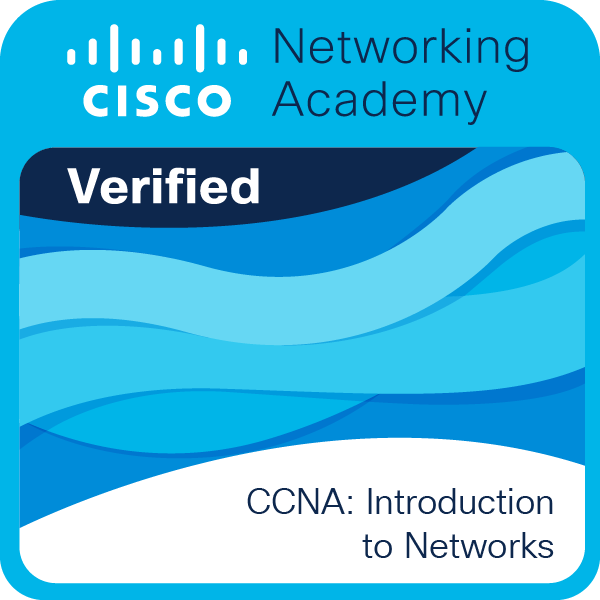
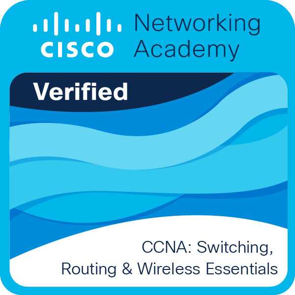
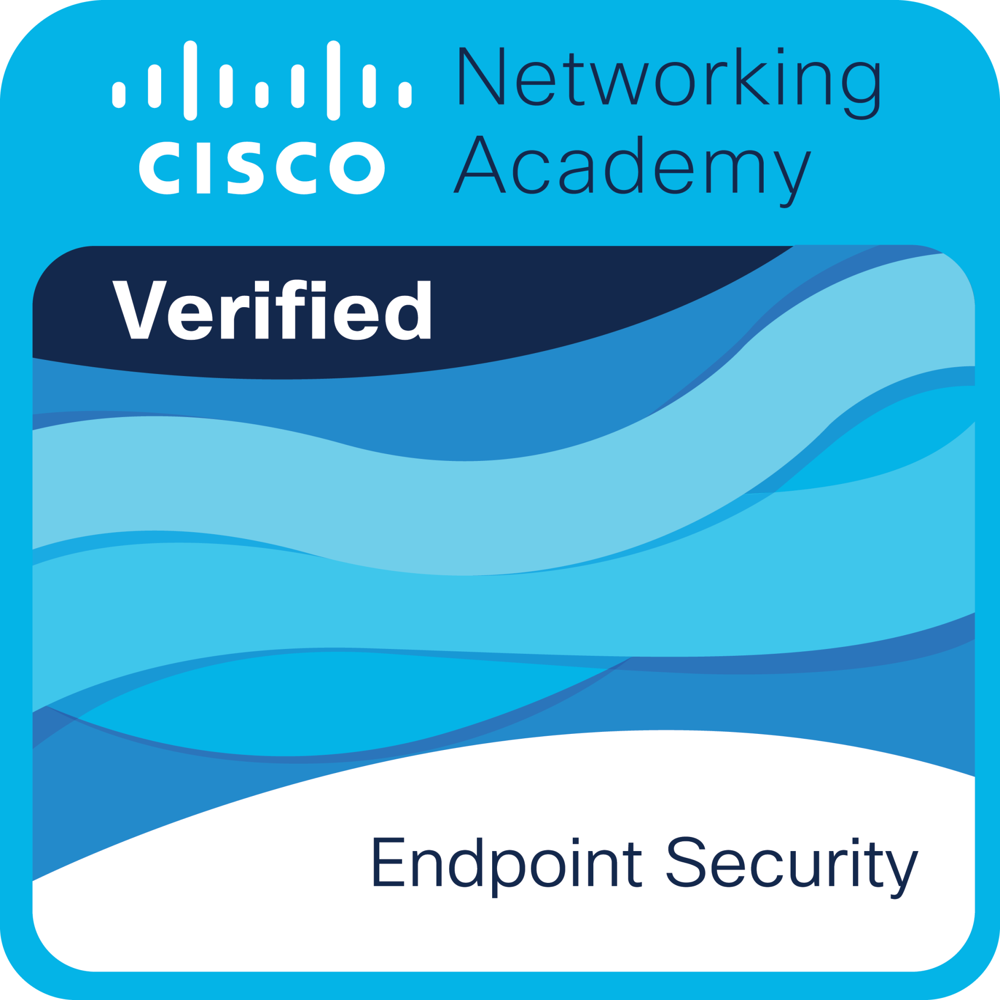
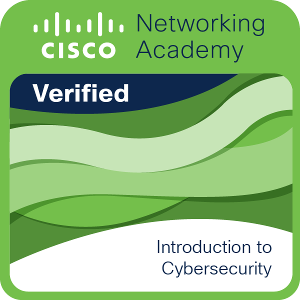
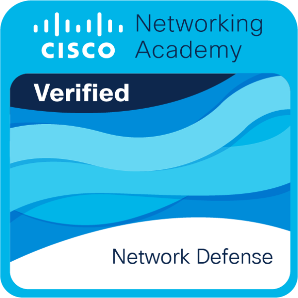

# 👋 ¡Hola! Bienvenido a mi perfil de GitHub

 

  

## 🧑‍💻 Sobre mí

Hola, soy **Smit**, principiante en la programación  alguien que disfruta crear, aprender cosas nuevas y meterle un poquito de pasión a cada proyecto.

## ✨ Mis Pasatiempos

    Soy amante de los videojuegos, desde juegos RPG donde me pierdo horas farmeando,  
    hasta shooters donde intento no morir en 2 segundos, pasando por mundos abiertos  
    donde termino explorando más que siguiendo la historia.
  

    Me gustan las historias con una narrativa que te deja pensando incluso después de terminar, no importa si es un shonen explosivo, un seinen profundo o una historia corta pero intensa; mientras tenga personajes que crezcan y un mundo bien construido, me engancha.
  

    Disfruto pasar el rato escuchando canciones de todo género. 
    La música es ese acompañante perfecto mientras programo, juego o simplemente me relajo.  
    Siempre estoy descubriendo canciones nuevas o playlists raras que encajan perfecto con lo que estoy haciendo en el momento.
  

    Soy alguien bastante relajado y disfruto mucho conversar, compartir curiosidades o simplemente escuchar lo que otros tienen que decir y me gusta crear un ambiente cómodo, donde las personas puedan ser ellas mismas sin sentirse juzgadas.  
  

## 🛠️ Tecnologías que uso

<h3>🧩 Lenguajes</h3>

 
 
 
 

<h3>🌐 Desarrollo Web</h3>

 
 
 
 
 

<h3>🗄️ Bases de Datos</h3>

 

 
 

<h3>⚙️ Servidores & Backend</h3>

 

 
 

<h3>🛠️ Herramientas & IDEs</h3>

 
 
 
 
 
 
 

<h3>💻 Sistemas Operativos</h3>

 
 
 

<h3>📦 Otros que uso en mi día a día</h3>

 
 
 
 

### 🏅 Badges
No sirve de nada, pero a poco no se ve chido :v

  
  
  
  

  

  
  
   

   

### 🚀 Proyectos Destacados

 

#### ⭐ Proyecto de Sistema de Sismos
- **Descripción:** Aplicación colaborativa por línea de comandos, simulando una red que reporta sismos y gestiona información.
- **Enfoque:** Demostración de lógica compleja y manejo de datos en tiempo real.
- **Tecnologías:** `Java`
- **Link al Repositorio:** [Proyecto-de-Sistema-de-Sismos](https://github.com/SmitBZ/Proyecto-de-Sistema-de-Sismos)

 

#### ✅ Sistema de Gestión Escolar (Colegio Amigos School)
- **Descripción:** Software robusto para la gestión de alumnos, personal y horarios de una institución educativa.
- **Enfoque:** Uso de formularios para una interfaz amigable (Front-end) y manejo de bases de datos para persistencia (Back-end).
- **Tecnologías:** `Java`, `MySQL`
- **Link al Repositorio:** [Gestion-de-Colegio-Amigos-School](https://github.com/SmitBZ/Gestion-de-Colegio-Amigos-School)

 

#### 💊 Botica Luhfarma
- **Descripción:** Sistema de inventario y punto de venta que controla productos, clientes y roles de empleados.
- **Enfoque:** Simulación de un entorno de negocios con funcionalidades CRUD.
- **Tecnologías:** `Java`
- **Link al Repositorio:** [Botica-Luhfarma](https://github.com/SmitBZ/Botica-Luhfarma)

 

#### 💬 Mensajería Latin Chat
- **Descripción:** Aplicación de chat simple para practicar la comunicación de red.
- **Enfoque:** Implementación de Sockets para comunicación P2P.
- **Tecnologías:** `Java`
- **Link al Repositorio:** [Mensajeria-Latin-Chat](https://github.com/SmitBZ/Mensajeria-Latin-Chat)

### 📌 Mis Estadísticas de GitHub

    

### 🗓️ Mi Actividad de Commits

## 🌐 Redes sociales

  
  
  

